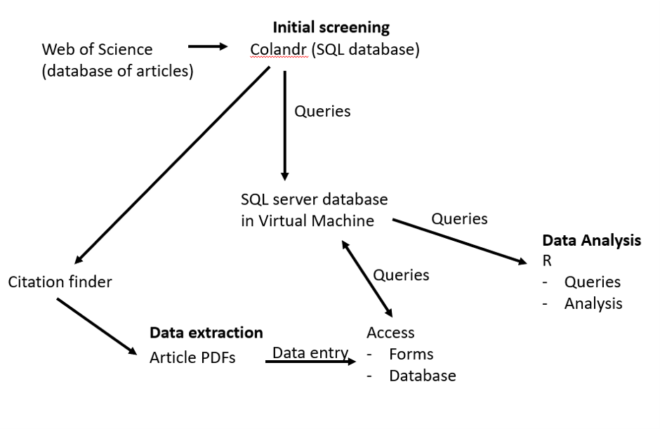
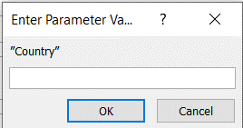

# Interactive Data Extraction framework 
Author: Grace Llewellyn
Created with funding from Bass Connections Student Research Award. Assistance provided by Tom Balmat (Research Data Analyst),  Dr. David Gill (Assistant Professor), Samantha Cheng (American Museum of Natural History)

## Overview of project

## Creating a new project
0. Secure a connection to Duke's VPN, instructions [here](https://oit.duke.edu/help/articles/kb0016403). You must have a Duke affiliation in order to do this step (student, professor, etc.)
1. Get onto the VM through your terminal with the command `ssh gal16@oegm.rc.duke.edu` and enter the password provided by Dr. David Gill when prompted. Run the command `mysql -p` to log into mysql. 
2. Create an ODBC connection (instructions in instructions/addingODBCConnector.docx under the header Adding ODBC connector Windows/Mac)
3. Create the schema for the information you want users to enter about each article and run this command in the VM terminal. See template for data schema in the instructions folder of this git repo. 
4. Export the data from Colandr into the table in the VM that you just created. This can be done in R and sample code is provided in queryingColandrToAccess.R. Code is also needed from the Colandr\_get.R file provided by Samantha Cheng, however this code cannot be shared publicly. Dr. David Gill will have access to this file. 
5. In a new Access file, link the tables that you created in the VM (instructions in instructions/addingODBCConnector.docx under the header Adding ODBC connector to Access)
6. After opening the desired table in Access, click on the Create tab then Form in the forms section. Then change the View to Design View through the Views section of the Home tab and modify the form accordingly if you would like combo boxes for some input fields. You can do this by right clicking the element then ->change to-> desired input method (combo box, etc). See instructions/CreatingComboBox.docx for more information.
7. Share this Access document and the instructions for "Adding entries to the table" in the README with other Duke faculty and students working on the project. Give the ArticleWriter login for those who can modify the tables, and the ArticleReader login for those who can only read the tables. 

### Creating a combo box from a record source
1. Create a Codes table in the SQL database
2. Link the Codes table within your Access app
3. Specify a query against the Codes table as the row source of a combo box
4. Add countries to the Code table
Note: More information about this can be found in the word document in this git repo entitled "instructions/CreatingComboBox.docx"

## Adding entries to the table (submitting an Access form, for students)
0. Create an ODBC connection (instructions in instructions/addingODBCConnector.docx under the header Adding ODBC connector Windows/Mac)
1. Open the provided Access file 
2. Log into the database with the information. Username: ArticleWriter, Database: Article, Password: David will provide
3. Double-click on the form you wish to fill out. On the home tab at the top, press the New button in the Records section. Enter the article ID number in order to modify the existing article's information that was loaded in from WOS
4. Enter the information about the article including if you would like to reject or accept
5. Press save in the Home tab and Records section after you finish entering the information.
6. Press Refresh All in the Home tab and records section in order to see the record you just added/ modified change in the table

## Other problems
In the instructions folder I have provided my email conversation with Tom Balmat at emailChainWithTom.docx which should help troubleshoot problems that arise since I likely encountered similar problems. 

## Other notes:
- When you are trying to use a combo box, the following message may pop up:

- If you are trying to open a table in Access and you correctly type the username/ password/ database combination to connect to the ODBC and when pressing Test you are told that Connection Successful, just delete all tables and reconnect the ODBC by following the steps for "Adding ODBC connector to Access" in the addingODBCConnector word document in the instructions folder. 
